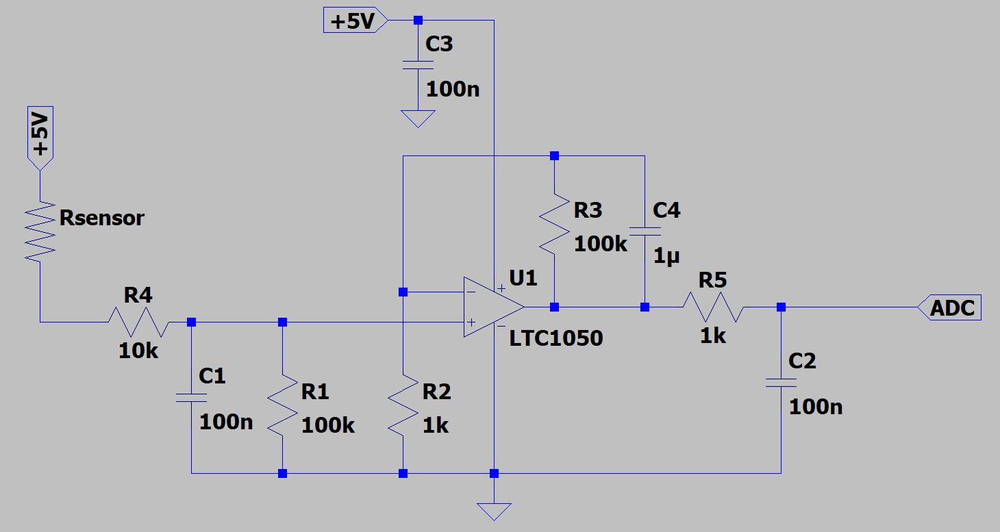

# 2021-2022_Cunnac_OyselMestre

MOSH INSA Toulouse: readme 2 qualité

# 1. Contexte et objectifs du projet

- Réaliser une jauge de contrainte low-tech à base de graphite: [Pencil Drawn Strain Gauges and Chemiresistors on Paper](https://www.researchgate.net/publication/259846610_Pencil_Drawn_Strain_Gauges_and_Chemiresistors_on_Paper)
- Concevoir un shield Arduino contenant l'amplificateur du capteur et les composants électroniques annexes (émetteur/récepteur Bluetooth, encodeur rotatif et écran OLED)
- Réaliser une application mobile connectée à l'émetteur Bluetooth du capteur sous Android Studio
- Évaluer le capteur sur un banc de test pour rédiger une datasheet
- Comparer la technologie mise en oeuvre avec autres types de jauges de contrainte (**on n'y est pas du tout pour le moment mais tout va bien se passer**)

# 2. Capteur de contrainte

> Notre capteur de contrainte utilise une jauge en papier munie d'un circuit résistif en graphite. L'intérêt de l'utilisation d'une telle jauge vient de sa facilité de mise en oeuvre. La jauge est directement tracée au crayon à papier et les matériaux nécessaires (papier et crayon) sont aisément procurables à moindre coût. 

> Dans son principe, une jauge de contrainte est un circuit résistif dont la résistance varie avec sa déformation. En mesurant les variations de résistance de la jauge, il est possible de déduire la contrainte et la déformation appliquées. Dans ce projet, notre jauge de contrainte est alimentée par une tension régulée de 5V d'une carte Arduino UNO. La mesure du courant circulant dans la jauge constitue le signal du capteur, qui doit être amplifié et filtré.

  ## 2.1. Circuit amplificateur
  > Bonjour je suis le circuit amplificateur au LTC1050
 
 > Le courant issu de la jauge de contrainte est de l'ordre de la centaine de nA. Le circuit amplificateur du capteur doit donc être en mesure d'extraire l'information de ce signal de très faible intensité.
 > Dans ce projet, nous avons décidé d'utiliser un montage transimpédence constitué d'un amplificateur opérationnel (AOP) pour traiter le signal de courant et fournir un signal en tension suffisant au convertisseur analogique-numérique (ADC) d'une carte Arduino UNO.
 
 >   Notre jauge de contrainte est composée d'une seule résistance en série (et non d'un pont de référence de type Wheatstone). De ce fait, notre signal est sensible aux dérives en tension de l'amplificateur. Notre AOP doit donc avoir un offset de tension très faible de manière à ce qu'il ne puisse fausser le signal fourni à l'ADC. Pour cela, la tension de dérive de l'AOP doit être inférieur à la plus petite variation de tension mesurable par l'ADC de l'Arduino UNO. Cette dernière utilise le convertisseur analogique-numérique 10-bit de l'[ATmega328p](https://ww1.microchip.com/downloads/en/DeviceDoc/Atmel-7810-Automotive-Microcontrollers-ATmega328P_Datasheet.pdf). La sensibilité de cet ADC est d'environ 1.07 mV, ce qui constitue la limite maximale de l'offset de notre AOP. Ainsi, pour notre montage, nous utilisons le [LTC1050](https://www.analog.com/media/en/technical-documentation/data-sheets/1050fb.pdf) présentant un offset de 5µv, bien inférieur à la limite calculée précédemment. À titre de comparaison, le LM747 présente un offset compris entre 1 et 5 mV, ce qui n'est pas acceptable pour notre application. 
 
 >   À partir de cet AOP, nous élaborons l'architecture du circuit amplificateur. Ce dernier dispose de trois étages de filtrage.
 >   - à l'entrée, un filtre passe-bas permet d'éliminer les nuisances RF provenant des dispositifs environnants (type émetteur bluetooth)
 >   - un autre filtre RC couplé à l'AOP permet de filtrer la composante du bruit à 50 Hz provenant du réseau électrique
 >   - à la sortie de l'amplificateur, un autre filtre RC permet de traiter les bruits issus du traitement du signal

 
  ## 2.2. Shield Arduino et autres composants
  > Parce qu'on aime la créativité au gp, notre capteur dispose d'un émetteur BT et est fourni avec un afficheur OLED muni d'un encodeur rotatoire. Ça c'est du capteur !
# 3. Application mobile
  > Une application mobile codée sous Android Studio (***Kotlin***) reçoit les informations du capteur par communication BT et permet d'exporter les données par SMS. Ça c'est le futur de l'instrumentation.
# 4. Banc de test, datasheet et discussions
  > On ne sera pas très bavards ici
