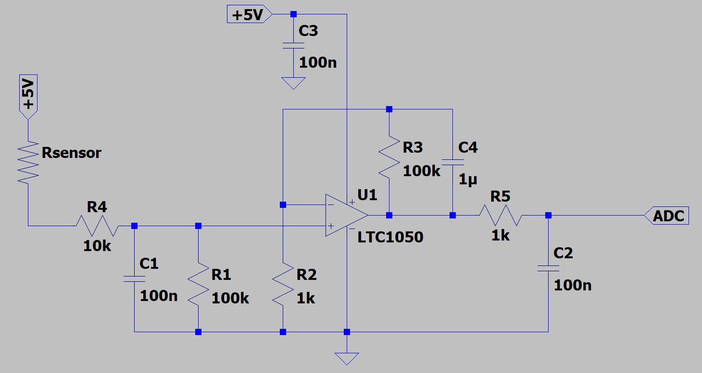
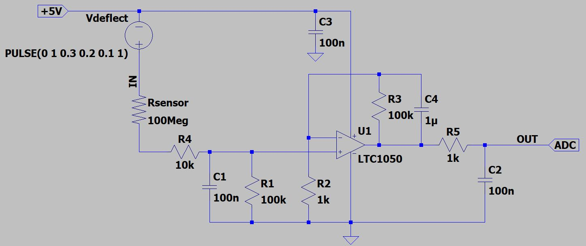
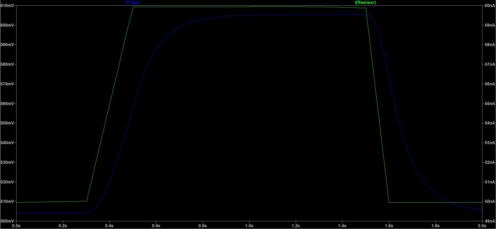
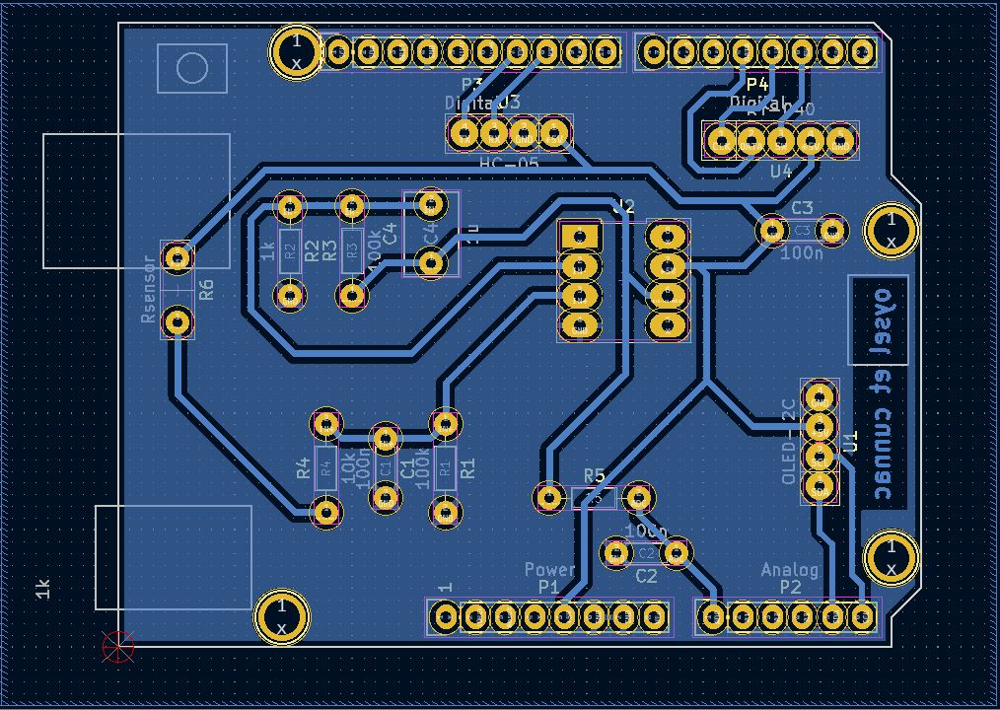
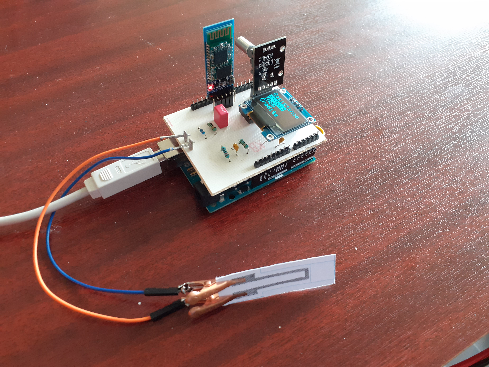
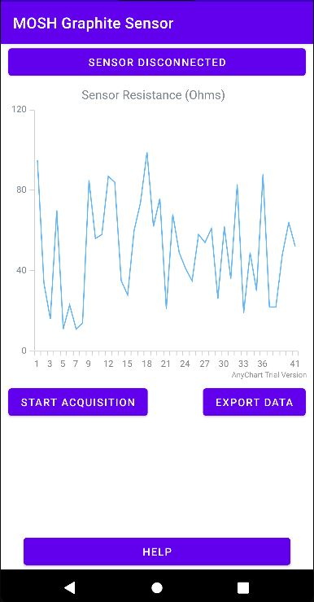

# 2021-2022_Cunnac_OyselMestre

MOSH INSA Toulouse: readme 2 qualité

# 1. Contexte et objectifs du projet

- Réaliser une jauge de contrainte low-tech à base de graphite: [Pencil Drawn Strain Gauges and Chemiresistors on Paper](https://www.researchgate.net/publication/259846610_Pencil_Drawn_Strain_Gauges_and_Chemiresistors_on_Paper)
- Concevoir un shield Arduino contenant l'amplificateur du capteur et les composants électroniques annexes (émetteur/récepteur Bluetooth, encodeur rotatif et écran OLED)
- Réaliser une application mobile connectée à l'émetteur Bluetooth du capteur sous Android Studio
- Évaluer le capteur sur un banc de test pour rédiger une datasheet
- Comparer la technologie mise en oeuvre avec autres types de jauges de contrainte (**on n'y est pas du tout pour le moment mais tout va bien se passer**)

# 2. Capteur de contrainte

> Notre capteur de contrainte utilise une jauge en papier munie d'un circuit résistif en graphite. L'intérêt de l'utilisation d'une telle jauge vient de sa facilité de mise en oeuvre. La jauge est directement tracée au crayon à papier et les matériaux nécessaires (papier et crayon) sont aisément procurables à moindre coût. 

> Dans son principe, une jauge de contrainte est un circuit résistif dont la résistance varie avec sa déformation. En mesurant les variations de résistance de la jauge, il est possible de déduire la contrainte et la déformation appliquées. Dans ce projet, notre jauge de contrainte est alimentée par une tension régulée de 5V d'une carte Arduino UNO. La mesure du courant circulant dans la jauge constitue le signal du capteur, qui doit être amplifié et filtré.

  ## 2.1. Circuit amplificateur
 
 > La conductance des jauges en graphite que nous utilisons est très faible (de l'ordre de la dizaine de nS) et est alimentée par une tension continue de 5V. Le circuit amplificateur du capteur doit alors être en mesure d'extraire l'information d'un signal en courant de très faible intensité.
 > Dans ce projet, nous avons décidé d'utiliser un montage transimpédance constitué d'un amplificateur opérationnel (AOP) pour fournir un signal en tension suffisant au convertisseur analogique-numérique (ADC) d'une carte Arduino UNO.
 
 >   Notre jauge de contrainte est composée d'une seule résistance en série (et non d'un pont de référence de type Wheatstone). De ce fait, notre signal est sensible aux dérives en tension de l'amplificateur. Notre AOP doit donc avoir un offset de tension très faible de manière à ce qu'il ne puisse fausser le signal fourni à l'ADC. Pour cela, la tension de dérive de l'AOP doit être inférieur à la plus petite variation de tension mesurable par l'ADC de l'Arduino UNO. Cette dernière utilise le convertisseur analogique-numérique 10-bit de l'[ATmega328p](https://ww1.microchip.com/downloads/en/DeviceDoc/Atmel-7810-Automotive-Microcontrollers-ATmega328P_Datasheet.pdf). La sensibilité de cet ADC est d'environ 1.07 mV, ce qui constitue la limite maximale de l'offset de notre AOP. Ainsi, pour notre montage, nous utilisons le [LTC1050](https://www.analog.com/media/en/technical-documentation/data-sheets/1050fb.pdf) présentant un offset de 5µV, bien inférieur à la limite calculée précédemment. À titre de comparaison, le LM741 présente un offset compris entre 1 et 5 mV, ce qui n'est pas acceptable pour notre application. 
 
 >   À partir de cet AOP, nous élaborons l'architecture du circuit amplificateur. Ce dernier dispose de trois étages de filtrage:
 >   - à l'entrée, un filtre passe-bas (R1C1) permet d'éliminer les nuisances RF provenant des dispositifs environnants (type émetteur bluetooth)
 >   - un autre filtre (R3C4) couplé à l'AOP permet de filtrer la composante du bruit à 50 Hz provenant du réseau électrique
 >   - à la sortie de l'amplificateur, un dernier filtre (R5C2) permet de traiter les bruits issus du traitement du signal

 >   La capacité C3 sert à filtrer les irrégularités de la tension d'alimentation de l'amplificateur. La résistance R2 sert à calibrer l'amplificateur sur le domaine de tension souhaité, qui est celui de l'ADC du micro-contrôleur. Lors de la phase de prototypage du circuit, nous avons utilisé un potentiomètre digital à la place de cette résistance pour trouver sa valeur. Enfin, la résistance R4 protège l'AOP contre les décharges électrostatiques et constitue un filtre RC avec la capacité C1 pour les bruits en tension.

**Figure 1: Circuit amplificateur transimpédance**
 
> Pour vérifier le fonctionnement du circuit sur LTSpice, nous simulons la déformation de la jauge par un pulse de tension en entrée (Figure 2). Cela engendre une variation du signal en courant fourni à l'amplificateur. Pour cette simulation, nous avons considéré une jauge d'une conductance de 10 nS, ce qui correspond à l'ordre de grandeur de notre jauge résistive de graphite:

**Figure 2: Simulation du fonctionnement du circuit amplificateur. Un pulse de tension permet de modéliser la déformation de la jauge et la variation du signal en courant.**
 

**Figure 3: Résultats de la simulation. En vert, le signal en courant fourni par la jauge et en bleu la tension de sortie de l'AOP.**

> Pour des courants d'entrée de l'ordre de la dizaine de nA nous obtenons en simulation une tension de sortie de l'ordre de la centaine de mV, ce qui est compris dans l'intervalle de tension pris en compte par l'ADC (de 0 à 1.1 V). De plus, pour la valeur de conductance choisie, la simulation montre que le signal fourni en sortie de l'AOP sans déformation du capteur est d'environ 500 mV. Cette valeur est très proche du centre de l'intervalle de tension de l'ADC, ce qui est optimal pour mesurer des variations positives et négatives de résistance.

  ## 2.2. Intégration Arduino
  > Notre capteur de contrainte est intégré avec son circuit amplificateur sur un circuit imprimé (PCB) que nous avons conçu sur le logiciel KiCad. Ce PCB est un shield pour la carte Arduino UNO qui pilote le capteur et qui intègre plusieurs composants annexes:
  > - un module de communication Bluetooth HC-05 qui permet d'envoyer les données du capteur à un smartphone doté de l'application liée au capteur
  > - un écran OLED I2C couplé à un encodeur rotatoire KY-040 qui sert d'interface utilisateur et permet de sélectionner le mode de fonctionnement du capteur (affichage de la valeur de résistance et/ou envoi des données bluetooth)

**Figure 4: Design du PCB. Notez que la masse reliée à l'OLED et à l'encodeur est connectée à la masse de l'Arduino par un mince canal passant derrière les broches (tout en haut du PCB). Il aurait été préférable d'avoir une meilleure connexion entre les différentes zones de masse du circuit imprimé.**

  > Un défaut de fabrication du PCB a court-circuité la broche numérique 5 Arduino normalement non-connectée à la masse. Pour remédier à ce problème, nous avons dû gratter le PCB au scalpel pour déconnecter cette broche. Cependant, lors de cette opération, nous avons créé une piscine de masse, c'est-à-dire qu'une partie du PCB normalement reliée à la masse est devenue flottante. La piscine de masse en question alimentait l'écran OLED et l'encodeur, ce qui les rendait inutilisables. Pour rectifier cette erreur, nous avons relié cette piscine à la masse du circuit par un fil.

  > Une fois le perçage, les soudures et les rectificatifs du PCB faits, nous obtenons un shield Arduino opérationnel.

**Figure 5: Shield opérationnel alimenté par une carte Arduino UNO. L'écran OLED affiche le menu déroulant navigable à l'aide de l'encodeur rotatoire.**

# 3. Application mobile
  > Dans le cadre de ce projet, nous avons programmé l'application mobile connectée au module Bluetooth du capteur sur Android Studio. L'application mobile est constituée d'une seule activité (Figure 4), sur laquelle il est possible d'acquérir les données du capteur en temps réel et de les tracer sur un graphe dynamique. Une fois les données acquises, il est aussi possible de les exporter sous forme de texte par SMS ou Email. Un bouton d'aide en bas de l'activité ouvre une fenêtre surgissante pour informer l'utilisateur du fonctionnement de l'application. Pour l'affichage des données sur le graphique, nous avons utilisé les bibliothèques en libre accès de la compagnie [AnyChart](https://www.anychart.com/).

**Figure XX: Page d'accueil de l'application mobile. Le tracé représenté sur cette image n'est pas issu des données de notre capteur.**

 > Pour la connection Bluetooth, le smartphone doit être appareillé au module du capteur avant de pouvoir se connecter via l'application mobile. L'application ne permet pas de choisir à quel module se connecter. En réalité, l'application est liée à un module bluetooth en particulier (celui fourni avec le capteur) et lui seul pourra être connecté au smartphone pour la transmission de données. Une piste d'amélioration consiste à afficher la liste des dispositifs appareillés pour se connecter au module souhaité. Nous n'avons cependant pas pu implémenter cette fonctionnalité par manque de temps.

# 4. Banc de test, datasheet et discussions
  > On ne sera pas très bavards ici
