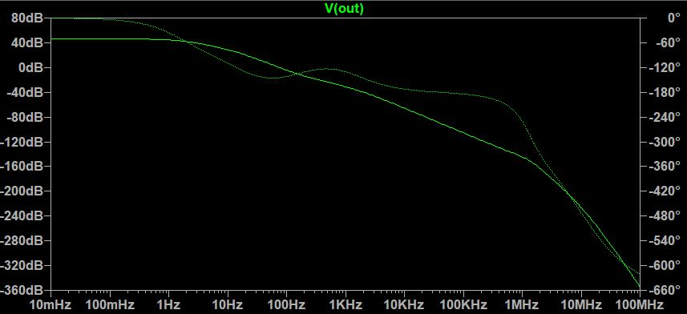
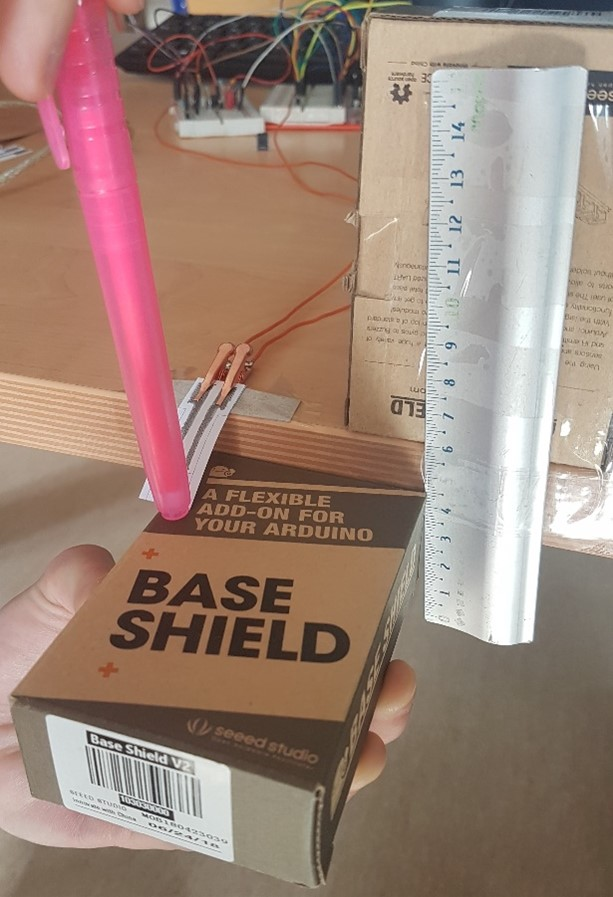
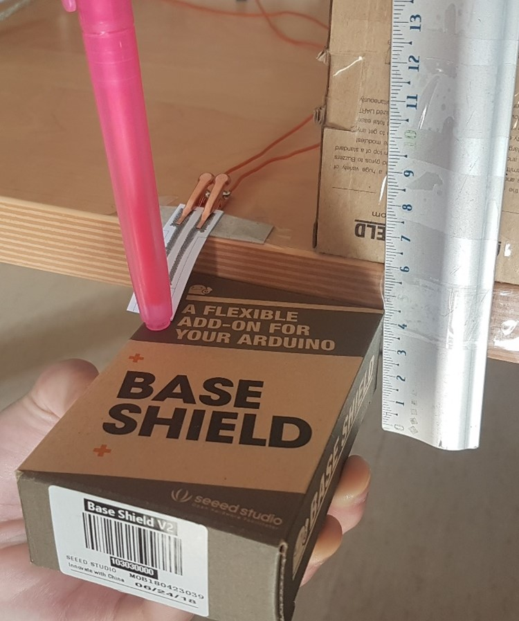
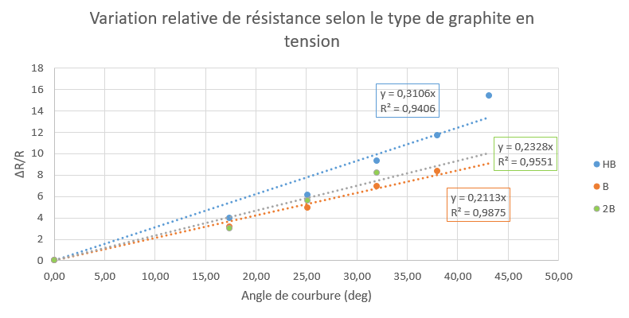
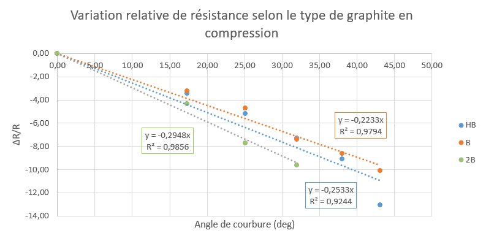
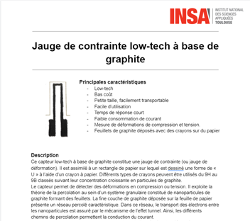
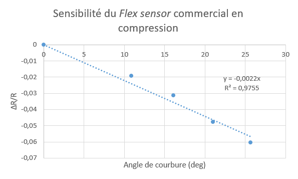
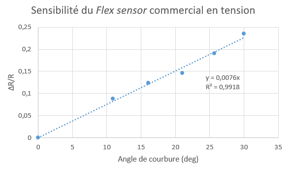

# 2021-2022_Cunnac_OyselMestre

# 1. Contexte et objectifs du projet

- [x] Réaliser une jauge de contrainte low-tech à base de graphite: [Pencil Drawn Strain Gauges and Chemiresistors on Paper](https://www.researchgate.net/publication/259846610_Pencil_Drawn_Strain_Gauges_and_Chemiresistors_on_Paper)
- [x] Concevoir un shield Arduino contenant l'amplificateur du capteur et les composants électroniques annexes (émetteur/récepteur Bluetooth, encodeur rotatif et écran OLED)
- [x] Réaliser une application mobile connectée à l'émetteur Bluetooth du capteur sous Android Studio
- [x] Évaluer le capteur sur un banc de test pour rédiger une datasheet et comparer la technologie mise en oeuvre avec un autre capteur commercial du même type

# 2. Capteur de contrainte

> Notre capteur de contrainte utilise une jauge en papier munie d'un circuit résistif en graphite. L'intérêt de l'utilisation d'une telle jauge vient de sa facilité de mise en oeuvre. La jauge est directement tracée au crayon à papier et les matériaux nécessaires (papier et crayon) sont aisément procurables à moindre coût. 

> Ce capteur low-tech exploite la théorie de la percolation au sein d’un système granulaire constitué de nanoparticules de graphite formant des feuillets. La fine couche de graphite déposée sur la feuille de papier présente un réseau percolé caractéristique. Dans ce réseau, le transport des électrons entre les nanoparticules est assuré par le mécanisme de l’effet tunnel. Ainsi, les différents chemins de percolation permettent la conduction du courant. 
Lors de l’application de déformations en tension, le réseau percolé se trouve directement étendu (le taux de percolation des réseaux diminue). Cette déformation induit une augmentation de la distance effective entre les particules de graphite au sein du réseau. Une partie des chemins de percolation sont par conséquent rompus. Ainsi, la conduction du matériau diminue, soit la résistance de la couche de graphite augmente. 
A l’inverse, lors de l’application de déformations en compression, le réseau percolé se trouve directement comprimé. Cette déformation induit une diminution de la distance effective entre les particules. Ainsi, de nouveaux chemins de percolation sont créés, la conduction du matériau augmente, soit la résistance de la couche de graphite diminue.

> Dans son principe, une jauge de contrainte est un circuit résistif dont la résistance varie avec sa déformation. En mesurant les variations de résistance de la jauge, il est possible de déduire la contrainte et la déformation appliquées. Dans ce projet, notre jauge de contrainte est alimentée par une tension régulée de 5V d'une carte Arduino UNO. La mesure du courant circulant dans la jauge constitue le signal du capteur, qui doit être amplifié et filtré.

  ## 2.1. Circuit amplificateur
 
 > La conductance des jauges en graphite que nous utilisons est très faible (de l'ordre de la dizaine de nS) et est alimentée par une tension continue de 5V. Le circuit amplificateur du capteur doit alors être en mesure d'extraire l'information d'un signal en courant de très faible intensité.
 > Dans ce projet, nous avons décidé d'utiliser un montage transimpédance constitué d'un amplificateur opérationnel (AOP) pour fournir un signal en tension suffisant au convertisseur analogique-numérique (ADC) d'une carte Arduino UNO.
 
 >   Notre jauge de contrainte est composée d'une seule résistance en série. De ce fait, notre signal est sensible aux dérives en tension de l'amplificateur. Notre AOP doit donc avoir un offset de tension en entrée très faible de manière à ce qu'il ne puisse fausser le signal fourni à l'ADC. Cela restreint notre choix d'amplificateur opérationnel. Nos jauges de contrainte en graphite ont une conductivité aux alentours de 10 nS. La jauge étant alimentée par 5V, nous nous attendons à avoir un signal en courant de l'ordre de 50 nA. En shuntant ce courant par une résistance de 100 kΩ, le signal en tension fourni à l'AOP est de 5 mV. À titre de comparaison, l'amplificateur [LM741](https://www.ti.com/lit/ds/symlink/lm741.pdf) présente un offset en entrée typique de 1 mV, et pouvant atteindre 5 mV. Ce composant n'est donc pas adapté pour notre utilisation. Ainsi notre amplificateur doit spécifiquement présenter un offset en entrée faible. Pour cette raison, nous utilisons le [LTC1050](https://www.analog.com/media/en/technical-documentation/data-sheets/1050fb.pdf), pour sa tension de dérive de 5 µV, soit 1000 fois plus faible que notre signal nominal de 5 mV.
 
 >   À partir de cet AOP, nous élaborons l'architecture du circuit amplificateur (cf. [Figure 1a](analog_circuit_images/analog_circuit.JPG)). Ce dernier dispose de trois étages de filtrage:
 >   - à l'entrée, un filtre passe-bas (R1C1) de fréquence de coupure de 16 Hz permet de filtrer les bruits en courant sur le signal d'entrée
 >   - un autre filtre passe bas de 1.6 Hz (R3C4) couplé à l'AOP permet de filtrer la composante du bruit à 50 Hz provenant du réseau électrique
 >   - à la sortie de l'amplificateur, un dernier filtre (R5C2) de 1.6 kHz permet de traiter les bruits dus à l'échantillonage de l'ADC

 >   La capacité C3 sert à filtrer les irrégularités de la tension d'alimentation de l'amplificateur. La résistance R2 sert à calibrer l'amplificateur sur le domaine de tension souhaité, qui est celui de l'ADC du micro-contrôleur. Lors de la phase de prototypage du circuit, nous avons utilisé un potentiomètre digital à la place de cette résistance pour trouver sa valeur. Enfin, la résistance R4 protège l'AOP contre les décharges électrostatiques et constitue un filtre RC avec la capacité C1 pour les bruits en tension.

**Figure 1a - Circuit amplificateur transimpédance. La résistance *Rsensor* représente la jauge de contrainte.**
 

**Figure 1b - Simulation AC du circuit amplificateur. Les fréquences de coupure à 1.6 Hz, 16 Hz et 1.6 kHz des trois filtres en cascade sont visibles. Cette simulation permet de vérifier le fonctionnement en fréquence de notre circuit.**

> Pour vérifier le fonctionnement normal du circuit sur LTSpice, nous simulons la déformation de la jauge par un pulse de tension en entrée (Figure 2). Ce pulse de tension génère une variation du courant en entrée de l'AOP. Virtuellement, cela représente la variation de conductance de la jauge due à sa déformation. Pour cette simulation, nous faisons varier la conductance de 5 nS à 20 nS, ce qui correspond à l'ordre de grandeur des jauges resistives utilisées. Ce faisant, nous balayons à peu près tout l'intervalle de signaux d'entrée possibles:

**Figure 2 - Simulation du fonctionnement du circuit amplificateur. Un pulse de tension permet de modéliser la déformation de la jauge et la variation du signal en courant.**
 

**Figure 3: Résultats de la simulation. En vert, le signal en courant fourni par la jauge et en bleu la tension de sortie de l'AOP.**

> Sur la plage de conductance prise en compte, le signal de sortie passe d'environ 240 mV à 1.05 V, ce qui ne sature pas l'ADC. L'amplitude crête-à-crête du bruit en 50 Hz est de 14 mV RMS. Ce signal est donc détectable par l'ADC qui a une sensibilité d'environ 5 mV. Le rapport signal sur bruit est de 25.6 dB pour la plus faible conductance et de 37.2 dB pour la conductance la plus élevée. Si notre signal sur cette simulation n'est fondamentalement pas considéré comme bon en terme d'instrumentation (rapport signal sur bruit inférieur à 40 dB), remarquons que naturellement, plus le signal de sortie est élevé (i.e. plus la conductance est élevée), plus le bruit à 50 Hz est écrasé par le signal. Cela signifie que plus la conductance de la jauge est élevée, plus nos mesures seront fiables et précises. Pour cette raison, nous avons tout intérêt à utiliser des jauges de contrainte de résistance relativement faibles (autour de 50 MΩ ou moins) pour nos mesures. Pour avoir une plus grande liberté sur les conductances des jauges utilisées, nous aurions pu intégrer directement sur le PCB un potentiomètre digital à la place de R2. Cela permettrait (après une étape de calibration) d'adapter le signal de sortie à la jauge résistive utilisée pour obtenir un signal optimal. Néanmoins, si nous nous restreignons à utiliser des jauges aux conductances assez élevées, alors nous obtenons un signal tout à fait acceptable.

  ## 2.2. Intégration Arduino
  > Notre capteur de contrainte est intégré avec son circuit amplificateur sur un circuit imprimé (PCB) que nous avons conçu sur le logiciel KiCad. Ce PCB est un shield pour la carte Arduino UNO qui pilote le capteur et qui intègre plusieurs composants annexes:
  > - un module de communication Bluetooth HC-05 qui permet d'envoyer les données du capteur à un smartphone doté de l'application liée au capteur
  > - un écran OLED I2C couplé à un encodeur rotatoire KY-040 qui sert d'interface utilisateur et permet de sélectionner le mode de fonctionnement du capteur (affichage de la valeur de résistance et/ou envoi des données bluetooth)

> 

> 
> 

**Figure 4 - Design du PCB. Notez que la masse reliée à l'OLED et à l'encodeur est connectée à la masse de l'Arduino par un mince canal passant derrière les broches digitales 0-7 (tout en haut du PCB). Il aurait été préférable d'avoir une meilleure connexion entre les différentes zones de masse du circuit imprimé.**

  > Un défaut de fabrication du PCB a court-circuité la broche numérique 5 Arduino normalement non-connectée à la masse. Pour remédier à ce problème, nous avons dû gratter le PCB au scalpel pour déconnecter cette broche. Cependant, lors de cette opération, une partie du PCB normalement reliée à la masse est devenue flottante. La zone de masse en question alimentait l'écran OLED et l'encodeur, ce qui les rendait inutilisables. Pour rectifier cette erreur, nous avons relié cette piscine à la masse du circuit par un fil.

  > Une fois le perçage, les soudures et les rectificatifs du PCB faits, nous obtenons un shield Arduino opérationnel. Nous avons également pu effectuer nos premières mesures avec l'application mobile:

 > 

 > 
 > 
 > 

**Figure 5 - En haut: shield opérationnel alimenté par une carte Arduino UNO. L'écran OLED affiche le menu déroulant navigable à l'aide de l'encodeur rotatoire. En bas: capteur en fonctionnement connecté à l'application mobile (première version).**

# 3. Programme Arduino

> Le programme Arduino permet de calculer la valeur de la résistance du capteur à partir de la valeur de tension mesurée par l'ADC de la carte. Cette mesure résistive est ensuite envoyée à l'application mobile via Bluetooth si cela est requis sur l'application. L'encodeur rotatif permet d'activer un menu sur l'OLED de choix d'affichage sur celui-ci : soit on affiche la valeur de la résistance, soit on affiche la valeur de la tension. On peut également choisir d'afficher une image ou les crédits (défilants).
> 
> A la mise en route du programme, une animation d'initialisation apparaît sur l'écran. Après cela, on a directement accès à la valeur résistive mesurée par le capteur. En tournant l'encodeur rotatoire, on peut rentrer dans le menu et sélectionner l'affichage de son choix toujours grâce à la rotation de l'encodeur. Ensuite, on valide le choix en faisant une pression sur l'encodeur.

# 4. Application mobile

  > Dans le cadre de ce projet, nous avons programmé sur Android Studio l'application mobile connectée au module Bluetooth du capteur. Cette dernière est constituée d'une seule activité sur laquelle il est possible d'acquérir les données du capteur en temps réel et de les tracer sur un graphique dynamique. Une fois les données acquises, il est possible de les exporter sous forme de texte par email ou SMS. L'application propose également d'ouvrir toute une variété d'applications pour l'export des données (réseaux sociaux et autres). Un bouton d'aide en bas de l'activité ouvre une fenêtre surgissante pour informer l'utilisateur du fonctionnement de l'application. Pour l'affichage des données sur le graphique, nous avons utilisé les bibliothèques en libre accès de la compagnie [AnyChart](https://www.anychart.com/).

 > 

 > 
 > 
 > 

 **Figure 6 - À gauche: page d'accueil de la dernière version de l'application mobile. Cette capture d'écran a été prise pendant le fonctionnement du capteur. À droite: fenêtre surgissante permettant l'export des données du capteur.**

 > Pour la connection Bluetooth, le smartphone doit être appareillé au module du capteur avant de pouvoir se connecter via l'application mobile. L'application ne permet pas de choisir à quel module se connecter. En réalité, l'application est liée à un module bluetooth en particulier (celui fourni avec le capteur) et lui seul pourra être connecté au smartphone pour la transmission de données. Une piste d'amélioration consiste à afficher la liste des dispositifs appareillés pour se connecter au module souhaité. Nous n'avons cependant pas pu implémenter cette fonctionnalité par manque de temps.

 > N.B: le fichier .apk de l'application mobile est situé dans le répertoire suivant: SensorApp/app/release/. Dans ce dossier se trouve aussi  le fichier .aab (Android App Bundle), correspondant au nouveau format de publication d'applications Android ayant l'avantage d'être plus compact que le format apk (plus d'informations [ici](https://developer.android.com/guide/app-bundle)).

# 5. Mesures : Banc de test, datasheet et discussions

  ## 5.1. Banc de test
 > Pour caractériser notre capteur, nous avons utilisé notre propre banc de test réalisé par nos soins car nous n’étions pas satisfaits par ceux existants. 

 > 

 > 
 > 
 > 

 
 **Figure 7 - Banc de tests mis en place.**
 
 > Ce banc de test est assez simpliste. On applique une courbure au capteur (en appuyant ou tirant sur l’extrémité de celui-ci) et on fait coulisser une pièce repère à la hauteur de cette extrémité, ce qui permet de lire la mesure de la flèche correspondante sur une règle. On peut ensuite remonter à l’angle de courbure du capteur. On réalise ainsi des mesures de résistance en fonction de l’angle de courbure aussi bien en tension qu’en compression.

  ## 5.2. Mesures et résultats
  
> Grâce à ce banc, les caractéristiques du capteur ont été déterminées par la mesure de la résistance pour différentes courbures appliquées soit différentes déformations appliquées. L’expérience a été réalisée pour plusieurs types de crayons (2H, HB et B) dont la concentration en graphite varie.
> 
> On obtient ainsi deux graphes : le premier donne la variation relative en fonction de la courbure en tension selon le type de graphite et le second de même pour la courbure en compression.

> 

 > 
 > 
 > 

**Figure 8 - Caractéristique du capteur en tension (en haut) et en conpression (en bas) représentant la variation de résistance en fonction de l’angle de courbure appliqué au capteur. La pente des courbes représente la sensibilité du capteur, que l'on compare avec un autre capteur de déformation dans la section *Discussions*.**

> En tension, lors de l’augmentation de la courbure nous observons une augmentation quasi-linéaire de la résistance (et inversement). En compression, lors de l’augmentation de la courbure nous observons une diminution quasi-linéaire de la résistance (et inversement). 
> 
> En théorie, les variations de résistance sont plus importantes lorsque la dureté du crayon est plus élevée (HB > B > 2B). Sur le premier graphique, en tension, c’est bien le cas pour HB par rapport aux B et 2B cependant le 2B devrait se trouver sous le B. De la même manière, pour le deuxième graphique, en compression, le HB est bien sous le B cependant le 2B encore une fois devrait se trouver au-dessus des deux précédents, ce qui n’est pas le cas. 
Cette anomalie peut s’expliquer par plusieurs facteurs : d’abord la non-répétabilité des mesures pour ce capteur mais aussi entre autres la quantité de graphite déposée sur le papier, la pression exercée sur le papier avec le crayon et le tracé effectué par le crayon. 

## 5.3. Datasheet

> 

> 
> 

**Figure 9 - Aperçu de la datasheet.**

> La datasheet regroupe l'ensemble des spécificités et caractéristiques électriques du capteur ainsi que les résultats des mesures réalisées avec le banc de test.

## 5.4. Discussions

>Ces différents résultats communiquent les avantages et les limites de ce type de jauges de contrainte.
>
> La première limite importante est la non-répétabilité de la mesure, liée entre autres à la détérioration du capteur lors des manipulations de celui-ci.
> 
> La seconde grande limite est le dépôt de graphite sur le papier. En effet ce dépôt va conditionner la mesure. Ainsi, la pression exercée par le crayon sur le papier, le nombre de passages de crayons ou encore le tracé de celui-ci vont impacter la caractérisation de la jauge.
Un procédé permettant un dépôt uniforme, précis et répétable permettrait de palier à cette limite.

 > Il est aussi intéressant de comparer notre technologie avec celle d'autres capteurs. Pour ce faire, nous avons testé avec le même banc le [Flex Sensor Spectra Symbol](https://cdn.sparkfun.com/assets/9/5/b/f/7/FLEX_SENSOR_-_SPECIAL_EDITION_DATA_SHEET_v2019__Rev_A_.pdf). Il s'agit une petite jauge résistive, de taille comparable à nos capteurs s'adaptant aussi bien à notre banc de test. Pour réaliser les mesures de résistance, étant donné que le Flex Sensor a une résistance de l'ordre de dizaines de kΩ et notre circuit conditionneur sous Arduino ne peut mesurer des résistances inférieures à 10 MΩ, nous avons utilisé un multimètre HP® 34410A pour effectuer les mesures:

> 

 > 
 > 
 > 

**Figure 10 - Résultats des mesures du Flex Sensor sur le banc de test. La sensibilité correspond à la pente de la courbe qui est écrite sur les tracés. La différence d'ordre de grandeur entre la sensibilité du Flex Sensor et de nos capteurs ne nous permettent pas de représenter les mesures des deux technologies sur le même graphe.**

> La sensibilité du Flex Sensor est environ 100 fois plus faible en compression et 30 fois plus faible en tension par rapport à nos jauges de graphite (cf. Figure 8). La sensibilité élevée des jauges de contrainte en graphite représente un avantage pour la mesure de déformations - une faible déformation induit une forte variation de résistance qui est plus aisée à mesurer. Il est donc important de remarquer que notre technologie, en plus d'avoir le très fort intérêt d'être bon marché, dispose également d'avantages concrets en terme d'instrumentation et de mesure. Nous pouvons alors conclure que la confection de jauges de contrainte en graphite présente des atouts certains par rapport à d'autres capteurs du même type. De ce fait, à condition que le processus de conception du capteur soit optimisé pour garantir la répétabilité et la qualité d'une mesure, nous pouvons penser que ce genre de jauge de contraintes *low-tech* a le potentiel pour trouver sa place dans des projets d'ingénierie et d'instrumentation divers. 
